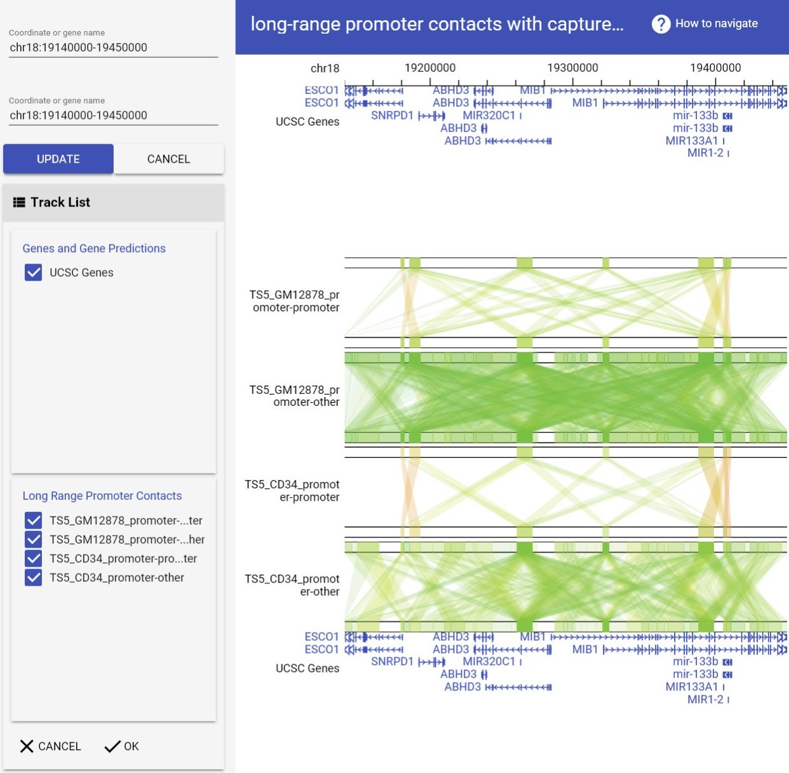

# GIVE: Build your own genome browser

GIVE  is an open source programming library that allows anyone with HTML programming experience to build custom genome browser websites or apps.  With a few lines of codes, one can add to a personal webpage an interactive genome browser that host custom data. It typically takes less than half a day to build a genome browser website with GIVE. 
This portable library encapsulates novel data communication and data visualization technologies, including new data structures and new memory management methods that enable efficient data transfer between the data-hosting website and internet browsers.  
GIVE is the acronym of **G**enomic **I**nteraction **V**isualization **E**ngine, although GIVE's utilities have outgrown its original name.

| [GIVE Tutorial](https://github.com/Zhong-Lab-UCSD/Genomic-Interactive-Visualization-Engine/tree/master/tutorials)  | [GIVE Manual](https://github.com/Zhong-Lab-UCSD/Genomic-Interactive-Visualization-Engine/blob/master/manuals/index.md) |
|--------------------------------------------------------------------------------------------------------------------|------------------------------------------------------------------------------------------------------------------------------|
| Example websites and line by line explanation.                                                                     | A full technical reference.                                                                                                |  

## [A 2-minute example](https://jsfiddle.net/frankyan/mcdng033/1/)


Just copy paste the two following lines to jsfiddle, an online HTML testing website for testing of your own HTML codes. 1) Go to  jsfiddle, 2) copy paste the following lines to the HTML panel (top left), 3) hit "run" button.
Congratulations! You are seeing your first genome browser webpage. You can modify and change using HTML as your wish.
```
<script src="https://www.givengine.org/libWC/webcomponents-lite.min.js"></script> 
<link rel="import" href="https://www.givengine.org/lib/chart-controller/chart-controller.html">
<!-- Embed the browser in your web page -->
<chart-controller title-text="long-range promoter contacts with capture Hi-C" ref="hg19" num-of-subs="2" coordinates='["chr18:19140000-19450000", "chr18:19140000-19450000"]' group-id-list='["genes", "CHi-C_promoter", "customTracks"]'>
</chart-controller>
```

****************

## Welcome to GitHub Pages

You can use the [editor on GitHub](https://github.com/qiuyangwu/GIVE_page/edit/master/index.md) to maintain and preview the content for your website in Markdown files.

Whenever you commit to this repository, GitHub Pages will run [Jekyll](https://jekyllrb.com/) to rebuild the pages in your site, from the content in your Markdown files.

### Markdown

Markdown is a lightweight and easy-to-use syntax for styling your writing. It includes conventions for

```markdown
Syntax highlighted code block

# Header 1
## Header 2
### Header 3

- Bulleted
- List

1. Numbered
2. List

**Bold** and _Italic_ and `Code` text

[Link](url) and 
```

For more details see [GitHub Flavored Markdown](https://guides.github.com/features/mastering-markdown/).

### Jekyll Themes

Your Pages site will use the layout and styles from the Jekyll theme you have selected in your [repository settings](https://github.com/qiuyangwu/GIVE_page/settings). The name of this theme is saved in the Jekyll `_config.yml` configuration file.

### Support or Contact

Having trouble with Pages? Check out our [documentation](https://help.github.com/categories/github-pages-basics/) or [contact support](https://github.com/contact) and we’ll help you sort it out.
